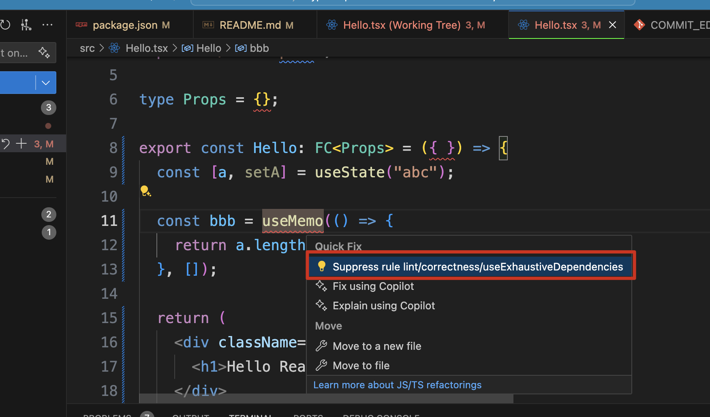

TypeScript React Biome Lint Demo
=================================

Biome是一个用rust写的js/ts linter/formatter/fixer，据说很快。

但是我发现对于react hook dependency的问题，它不能像eslint插件那样自动修下，只能提示错误，这不太方便。

这里就只能添加comment禁止检查的选项，而没有自动修正的选项。


生成biome.json:

```
pnpm run init
```

Fix:

```
npm run fix
```
